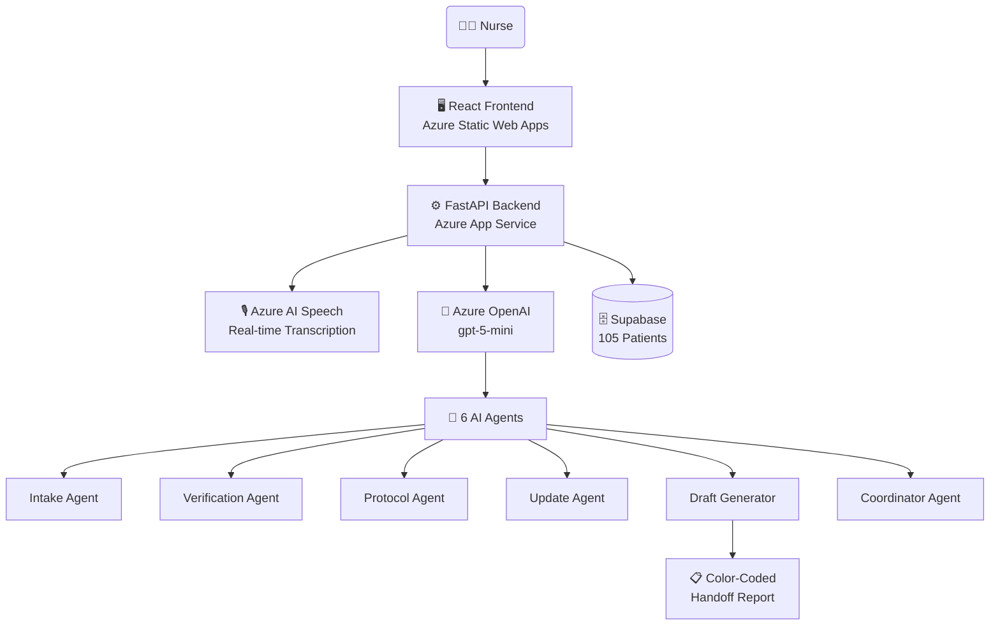

<div align="center">

# 💧 CascadeAI

### Multi-Agent Clinical Handoff Intelligence

*Preventing medical errors through intelligent multi-agent coordination with AI-powered color-coded handoffs*

<br/>

[](https://youtu.be/J_4C2QSGz2Q)
[](https://happy-sand-07c137903.6.azurestaticapps.net)
[](https://aka.ms/aidevdayshackathon)
[]()

<br/>

**[▶️ Watch Demo](https://youtu.be/J_4C2QSGz2Q) · [🌐 Try Live App](https://happy-sand-07c137903.6.azurestaticapps.net) · [📂 GitHub](https://github.com/sageofninetale/microsoft-ai-dev-days-2026)**

</div>

---

## 🎬 Demo

<div align="center">

[](https://youtu.be/J_4C2QSGz2Q)

*Click to watch the full demo on YouTube*

</div>

---

## 🎯 Problem Statement

**80% of serious medical errors involve miscommunication during nurse handoffs.** When nurses change shifts, critical information gets lost:

| Risk | Impact |
|------|--------|
| Missed allergies | Adverse drug reactions |
| Forgotten lab results | Delayed diagnosis |
| Unclear protocols | Suboptimal care |

**Current tools are passive** — they just display what nurses manually enter. **CascadeAI is intelligent** — 6 specialized AI agents actively verify, cross-check, and protocol-align clinical handoffs in real-time.

---

## 🤖 Multi-Agent Architecture



### Agent Overview

| Agent | Role | Key Output |
|-------|------|-----------|
| **Intake** | Transcribes audio/text, extracts clinical data | Structured JSON + confidence score (0.15–0.95) |
| **Verification** | Cross-references handoff against EMR database | Severity findings (CRITICAL / HIGH / MEDIUM / LOW) |
| **Protocol** | Validates ACS, Fall Risk, Hypertension protocols | Compliance score 0.0–1.0 + actionable recommendations |
| **Update** | Processes real-time nurse updates during shifts | Verified update with EMR discrepancy alerts |
| **Draft Generator** | Aggregates all shift data → color-coded handoff | Full report: timeline, meds, vitals, narrative |
| **Coordinator** | Orchestrates all agents, calculates risk score | Unified safety report + top 5 priority actions |

### System Flow

```
┌─────────────────────────────────────────────────────────┐
│                    FRONTEND UI                          │
│  • Nurse selects shift & patient                        │
│  • Records audio OR types text updates                  │
│  • Azure Speech transcribes audio in real-time          │
└─────────────────┬───────────────────────────────────────┘
                  ↓
┌─────────────────────────────────────────────────────────┐
│              UPDATE AGENT (Real-time)                   │
│  • AI auto-detects update type (med/vital/procedure)    │
│  • Extracts structured data                             │
│  • Cross-references with EMR                            │
│  • Saves to database with verification status           │
└─────────────────┬───────────────────────────────────────┘
                  ↓
┌─────────────────────────────────────────────────────────┐
│         DRAFT GENERATOR AGENT (End of shift)           │
│  • Fetches all updates + patient EMR data               │
│  • Generates color-coded handoff:                       │
│    - Safety alerts (RED/ORANGE/YELLOW severity)         │
│    - Chronological timeline with colored dots           │
│    - Medications grid with status badges                │
│    - Vitals display with severity classification        │
│    - Key changes + pending actions                      │
│    - Narrative summary (150–250 words)                  │
└─────────────────────────────────────────────────────────┘
```

---

## 🎨 Color-Coded Severity System

| Color | Severity | Clinical Meaning | Examples |
|-------|----------|-----------------|---------|
| 🔴 **RED** | CRITICAL | Immediate life-threatening | Severe hypotension, Respiratory distress |
| 🟠 **ORANGE** | HIGH RISK | Requires immediate action | New chest pain, Medication allergy reaction |
| 🟡 **YELLOW** | CAUTION | Monitor closely | Mild fever, Increasing pain |
| 🟢 **GREEN** | VERIFIED | EMR-confirmed, all clear | Confirmed medications, Vitals WNL |
| 🔵 **BLUE** | INFORMATIONAL | Routine updates | Patient ambulated, Family visit |
| ⚪ **GRAY** | NEUTRAL | Standard care | Routine assessments, Shift notes |

---

## ⚡ Performance

| Operation | Before | After | Improvement |
|-----------|--------|-------|-------------|
| Update submission | 5–10s | 3–5s | ~50% faster |
| Draft generation | 15–20s | 8–12s | ~50% faster |
| Audio transcription | Unreliable | Reliable | 40% more reliable |

---

## 🛠️ Tech Stack

**Azure AI Services:**
| Service | Usage |
|---------|-------|
| Azure OpenAI (`gpt-5-mini`) | All 6 agent reasoning + narrative generation |
| Azure AI Speech | Real-time audio transcription |
| Azure Static Web Apps | Frontend hosting |
| Azure App Service | Python FastAPI backend |

**Application:**
| Layer | Technology |
|-------|-----------|
| Frontend | React 18.2.0, MediaRecorder API, Axios |
| Backend | Python 3.11+, FastAPI, uvicorn |
| Database | Supabase (PostgreSQL) — 105 synthetic patients, 5 tables |
| Dev Tools | VS Code, GitHub Copilot, Git |

---

## 🚀 Live Deployment

| Service | URL |
|---------|-----|
| 🌐 Website + App | https://happy-sand-07c137903.6.azurestaticapps.net |
| 📱 React App (direct) | https://happy-sand-07c137903.6.azurestaticapps.net/app/index.html |

---

## 📦 Installation

<details>
<summary>Click to expand installation instructions</summary>

### Prerequisites
- Python 3.11+
- Node.js 18+ and npm
- Azure account with OpenAI + Speech services
- Supabase account (free tier works)

### Setup

1. **Clone the repository:**
```bash
git clone https://github.com/sageofninetale/microsoft-ai-dev-days-2026.git
cd microsoft-ai-dev-days-2026
```

2. **Install dependencies:**
```bash
pip install -r backend/requirements.txt
cd frontend && npm install && cd ..
```

3. **Configure environment variables** — create `.env` in the root:
```bash
AZURE_OPENAI_ENDPOINT=https://your-endpoint.openai.azure.com/
AZURE_OPENAI_KEY=your_key_here
AZURE_OPENAI_DEPLOYMENT=gpt-5-mini

AZURE_SPEECH_KEY=your_speech_key_here
AZURE_SPEECH_REGION=uksouth

SUPABASE_URL=https://xxxxx.supabase.co
SUPABASE_KEY=your_service_role_key_here
```

4. **Populate the EMR database:**
```bash
python backend/generate_patients.py
```

5. **Start both servers:**
```bash
# Terminal 1 — Backend
python3 -m uvicorn backend.api:app --host 0.0.0.0 --port 8000

# Terminal 2 — Frontend
cd frontend && npm start
```

App runs at: http://localhost:3000

</details>

---

## 🎮 Using the App

<details>
<summary>Click to expand usage guide</summary>

1. **Start a shift** — select a nurse and enter patient ID(s) (e.g. `P001`, `P001,P025,P069`)

2. **Add patient updates:**
   - **Audio:** Click "🎤 Record Audio", speak for up to 15 seconds, submit
   - **Text:** Type an update, AI auto-detects the correct update type

3. **View update history** — click "🔍 Show All Updates" to see all updates with verification badges (✅ Verified / ⚠️ Unverified)

4. **Generate handoff** — click "📋 Generate Draft Handoff" (8–12 seconds) to get the full color-coded report with narrative summary

5. **Copy narrative** — click "📋 Copy Narrative" to copy the 150–250 word summary to clipboard

### Sample Patients to Try

| Patient | Condition | Expected |
|---------|-----------|---------|
| `P001` | John Smith | Hypertension protocol triggers |
| `P069` | Scott Lynch | Fall risk protocol (score 7) |
| `P026` | — | ACS protocol (chest pain) |

</details>

---

## 🧪 Testing

<details>
<summary>Click to expand test suite</summary>

```bash
# Intake Agent — 7 edge cases (confidence 0.15–0.95)
python backend/test_edge_cases.py

# Verification Agent — EMR cross-reference
python backend/test_verification.py

# Protocol Agent — ACS, Fall Risk, Hypertension
python backend/test_protocol.py

# Draft Generator — full handoff generation
python backend/test_draft_generator.py

# Update Agent
python backend/test_update_agent.py
```

</details>

---

## 📊 System Metrics

| Metric | Value |
|--------|-------|
| Total lines of code | 6,000+ |
| AI agents | 6 (100% complete) |
| API endpoints | 10+ |
| Database tables | 5 |
| Patient records | 105 |
| Color severity levels | 6 |
| Protocols checked | 3 (ACS, Fall Risk, Hypertension) |

---

## 👥 Team

**Developer:** Aryan Subhash
**GitHub:** [@sageofninetale](https://github.com/sageofninetale)

---

## 🏆 Hackathon Submission

**Event:** AI Dev Days Hackathon 2026
**Category:** 🤝 Best Multi-Agent System

**Why multi-agent?**
- ❌ A single AI can't excel at extraction, verification, protocol checking, AND summarization simultaneously
- ✅ Each specialist agent is optimized for its domain
- ✅ Every decision is traced with clinical safety reasoning
- ✅ New agents (radiology, pharmacy) can be added without refactoring existing ones
- ✅ Real-time coordination — Update Agent processes inputs as they arrive, Draft Generator aggregates at shift end

---

## 📝 License

MIT License — See [LICENSE](LICENSE)

---

<div align="center">
<b>Built with 💧 for safer healthcare handoffs</b>
</div>
